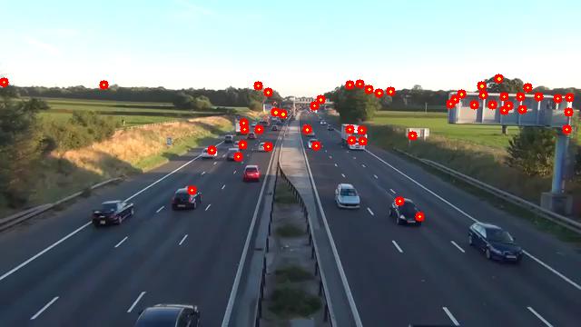

# Advanced OpenCV for Computer Vision

This repository demonstrates the implementation of advanced computer vision concepts and algorithms using the OpenCV library in Python. The focus is on practical applications of techniques such as background subtraction, optical flow, image denoising, and more.

## Table of Contents
1. [Project Overview](#project-overview)
2. [Technologies Used](#technologies-used)
3. [Project Structure](#project-structure)
4. [Implementation](#implementation)
    - [1. Background Subtraction](#background-subtraction)
    - [2. Color Quantization](#color-quantization)
    - [3. Dense Optical Flow](#dense-optical-flow)
    - [4. Depth Map Stereo](#depth-map-stereo)
    - [5. Epipolar Geometry](#epipolar-geometry)
    - [6. HDR Imaging](#hdr-imaging)
    - [7. Image Denoising](#image-denoising)
    - [8. Lucas Kanade Optical Flow](#lucas-kanade-optical-flow)
    - [9. CamShift](#camshift)
    - [10. MeanShift](#meanshift)
5. [Conclusion](#conclusion)

## Repository Overview
This repository provides an in-depth exploration of advanced computer vision techniques using the OpenCV library. Each script is designed to demonstrate a different algorithm, ranging from background subtraction and object tracking to optical flow and HDR imaging.

## Technologies Used
- **Programming Language:** Python
- **Libraries:** OpenCV (cv2), NumPy

## Project Structure
1. **Background Subtraction:** Extract moving objects from a video stream.
2. **Color Quantization:** Reduce the number of colors in an image using K-means clustering.
3. **Dense Optical Flow:** Track motion throughout a video using the Farneback algorithm.
4. **Depth Map Stereo:** Generate depth maps using stereo images.
5. **Epipolar Geometry:** Use SIFT to find matching points between stereo images.
6. **HDR Imaging:** Create high dynamic range images from multiple exposures.
7. **Image Denoising:** Apply noise reduction techniques to improve image quality.
8. **Lucas Kanade Optical Flow:** Implement this sparse optical flow technique for tracking points.
9. **CamShift:** Track objects in a video using the CamShift algorithm.
10. **MeanShift:** Track objects using the MeanShift algorithm.

## Implementation

### 1. Background Subtraction
- **Description:** Background subtraction is a technique used to separate moving objects from a static background in a video stream. By analyzing the difference between the current frame and a reference background model, it highlights objects in motion. This method is commonly applied in fields such as surveillance systems, motion detection, and traffic monitoring. The implementation utilizes OpenCV's `BackgroundSubtractorMOG2`, which employs a mixture of Gaussians to model the background. The algorithm dynamically updates the background model to adapt to gradual changes in lighting and scene conditions, effectively distinguishing moving objects from the background.

- **Sample Frame:**
  

### 2. Color Quantization
- **Description:** Color quantization is a process that reduces the number of distinct colors in an image. This is particularly useful for image compression and reducing the complexity of image processing tasks. The technique uses K-means clustering to group similar colors and replace them with a representative color for each cluster. By doing so, it simplifies the image while preserving its visual quality. The result is an image that appears with fewer colors, which is beneficial for efficient storage and faster processing in various applications like computer graphics and digital image processing.

- **Sample Image:**
  

### 3. Dense Optical Flow
- **Description:** Dense optical flow is used to estimate motion between two consecutive frames in a video sequence. The Farneback algorithm is employed here to calculate the dense optical flow, which tracks the movement of each pixel across frames. Unlike sparse optical flow methods, which track only a subset of points, dense optical flow provides motion vectors for all pixels, enabling a more comprehensive analysis of motion patterns within the scene. This technique is commonly used in video analysis tasks, such as object tracking, motion segmentation, and video stabilization.

- **Sample Frames:**
  
  

### 4. Depth Map Stereo
- **Description:** Generates a depth map from a pair of stereo images, which represent the same scene from slightly different angles. By calculating the disparity between corresponding points in the left and right images, the depth information of objects within the scene can be inferred. This technique is fundamental in 3D reconstruction, enabling the estimation of distances to various objects. The depth map provides a grayscale image where pixel intensity indicates the relative distance of objects from the camera, with darker shades representing closer objects and lighter shades indicating farther ones.

- **Sample Output:**
  

### 5. Epipolar Geometry
- **Description:** Utilizes the Scale-Invariant Feature Transform (SIFT) algorithm to identify and match keypoints between a pair of stereo images. This matching process is crucial for understanding the geometric relationship between the two views of the same scene. By finding corresponding points in both images, the fundamental matrix can be estimated, which encapsulates the epipolar geometry. This concept is vital in computer vision for tasks such as 3D scene reconstruction, camera calibration, and object recognition. The matched points are visualized to highlight the epipolar lines, demonstrating how points in one image relate to lines in the other.

- **Sample Output:**
  

### 6. HDR Imaging
- **Description:** Combines multiple images of the same scene taken at different exposure levels to produce a single high dynamic range (HDR) image. This technique captures a broader range of luminosity, bringing out details in both the dark and bright areas that are typically lost in standard photography. The process involves aligning the input images, merging them using the Debevec method (merging multiple images taken at different exposure levels into a single high dynamic range (HDR) image) to construct the HDR image, and finally tone mapping it to create a visually appealing result suitable for display on standard monitors. HDR imaging is widely used in photography and film to create more realistic and detailed visuals.

- **Sample Output:**
  

### 7. Image Denoising
- **Description:** Enhances image quality by reducing noise using techniques like Fast Non-Local Means Denoising. This process smooths out noise while preserving important details and edges in both colored and grayscale images.

- **Sample Images:**

### 8. Lucas Kanade Optical Flow
- **Description:** Utilizes the Lucas Kanade method for tracking sparse points in a video. The Lucas Kanade method is an optical flow algorithm that assumes small motion between consecutive frames and uses a local approximation of the image's motion. It is highly effective for tracking the movement of distinct features across frames. The algorithm relies on the Shi-Tomasi corner detection method to identify good features to track. The Shi-Tomasi method is an improvement over the Harris corner detector and selects corners based on the eigenvalues of the gradient matrices, ensuring the features are well-defined and trackable.

- **Sample Frames:**

### 9. CamShift
- **Description:** Utilizes the CamShift (Continuously Adaptive Mean Shift) algorithm for object tracking in videos. CamShift builds upon the MeanShift algorithm by dynamically adjusting the size and orientation of the tracking window, making it more robust for tracking objects that change in size or rotation. It is particularly effective for tracking objects based on color histograms.
  
- **Sample Frames:**

### 10. MeanShift
- **Description:** Implements the MeanShift algorithm for object tracking in videos. MeanShift is a non-parametric feature-space analysis technique used for locating the maxima of a density function. In object tracking, it is employed to track objects based on color histograms. The algorithm iteratively shifts a window over the image to the area with the highest density (most similar color histogram), making it effective for tracking objects that have a consistent appearance.
  
- **Sample Frames:**

## Conclusion
This repository provides a comprehensive exploration of advanced computer vision techniques using OpenCV. From object tracking and optical flow to HDR imaging and epipolar geometry, these scripts serve as practical implementations of complex algorithms in computer vision.

---

Feel free to use and modify this code for educational and research purposes. Contributions and suggestions are welcome.
